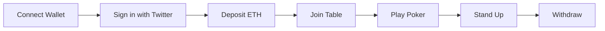

# How To Play

This section covers everything you need to know to start playing Clout Cards.

## Prerequisites

Before you can play, you'll need:

1. **A Web3 wallet** (MetaMask recommended)
2. **A Twitter account** for identity verification
3. **Some ETH** on Base Sepolia for deposits

## Steps to Get Started

| Step | Description |
|------|-------------|
| 1. [Getting Started](getting-started.md) | Connect your wallet and Twitter account |
| 2. [Depositing Funds](depositing.md) | Add ETH to your escrow balance |
| 3. [Joining a Table](joining-table.md) | Find a table and buy in |
| 4. [Playing Poker](playing-poker.md) | Learn the game flow and actions |
| 5. [Withdrawing Funds](withdrawing.md) | Cash out your winnings |

## Quick Overview

